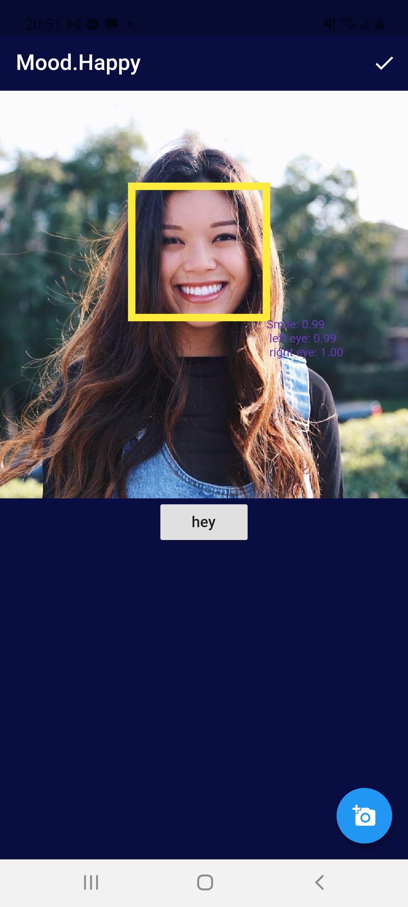

<h1>Ứng dụng MoodMusic - nghe nhạc theo cảm xúc</h1>

Ứng dụng MoodMusic giúp mọi người nghe nhạc theo cảm xúc của mình 

<h2>
1. Chức năng</h2>
    

- Đăng nhập, đăng kí

    
	

    
 
- Nghe nhạc

    
	

    
 
- Xác định cảm xúc

    
	

	

     
- Đánh giá phim

    
	
	

<h2>2. Yêu cầu thiết bị</h2>
    
- Android studio: 4.0 

    
- Gradle: 4.1

    
- Min sdk: 19

    
- Target sdk: 26

<h2>3. Thư viện và công nghệ: </h2>
    
- Language: Dart

	
- Framework: Flutter

    
- Database: SQL

<h2>4. Tác giả: </h2>
    
- Nguyễn Hoàng Trường - 17521185@gm.uit.edu.vn

	
- Phạm Duy Cường - 17520309@gm.uit.edu.vn

<h2>5. Link download: </h2>
    <a href="https://drive.google.com/file/u/1/d/1tx7OEpxmCN61URXtsKIwVViAh3bK-1Hz/view?usp=sharing">https://drive.google.com/file/u/1/d/1tx7OEpxmCN61URXtsKIwVViAh3bK-1Hz/view?usp=sharing</a>

